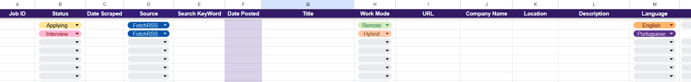
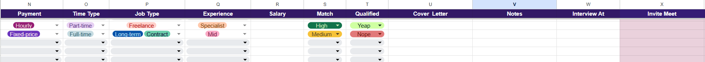
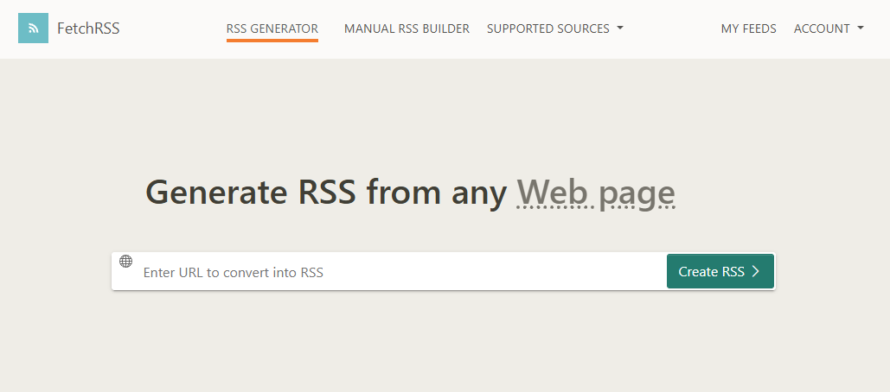

# LinkedIn Job Scraper & AI Application Pipeline

        

A **low-cost, human-in-the-loop job intelligence and application-support pipeline** built with n8n.

The system monitors configurable LinkedIn job searches, identifies new postings, enriches incomplete job data, evaluates technical fit against an active resume, stores opportunities in a structured Google Sheets workspace, and generates fact-checked recruiter outreach messages **only after human qualification**.

The project is composed of three independent n8n workflows:

```text
Job-scraper-LinkedIn
        ↓
Job-saver-LinkedIn
        ↓
Human Qualification
        ↓
Cover-letter-generator
```

Each workflow has a separate responsibility, execution pattern, and cost profile.

The central engineering principle is:

> **Use deterministic automation for tasks that do not require semantic judgment. Use AI only where language understanding adds real value, and preserve human control over application decisions.**

## Problem

Managing a serious job search across multiple roles and search strategies quickly becomes repetitive.

A manual process typically requires the candidate to:

- repeat several LinkedIn searches;
- identify newly published opportunities;
- open and inspect each vacancy;
- compare jobs discovered through overlapping searches;
- avoid reviewing the same posting multiple times;
- extract useful information from inconsistent job descriptions;
- compare requirements with the current resume;
- decide whether the opportunity is worth pursuing;
- prepare recruiter outreach;
- track the application lifecycle manually.

Using an LLM to perform every stage would simplify the workflow superficially, but would also introduce unnecessary:

- token consumption;
- latency;
- cost;
- hallucination surface;
- repeated browsing;
- dependency on AI for tasks that normal automation can solve reliably.

The engineering challenge was therefore not simply to automate job searching.

It was to decide **which operations should remain rule-based, which genuinely benefit from semantic AI, and where human judgment should remain mandatory**.

## Solution

I built the system as three specialized n8n workflows connected through Google Drive, Google Sheets, LinkedIn public job pages, FetchRSS, and Groq.

The complete pipeline:

1. monitors configurable LinkedIn searches;
2. retrieves recent opportunities through RSS;
3. normalizes incoming job records;
4. extracts LinkedIn Job IDs;
5. removes duplicate postings across feeds;
6. verifies whether each Job ID already exists in historical monthly records;
7. retrieves the public LinkedIn page only for new jobs;
8. deterministically extracts explicit job information;
9. removes unnecessary description noise before AI processing;
10. loads the active resume once per workflow execution;
11. uses Groq only where semantic interpretation is useful;
12. calculates a technical Match between the vacancy and the active resume;
13. stores new jobs in the correct monthly Google Sheets tab;
14. leaves the final qualification decision to the user;
15. processes only manually qualified opportunities;
16. generates recruiter outreach through Groq;
17. performs a second factual AI review against the resume;
18. updates only the intended Google Sheets cell.

The system is intentionally **not an autonomous mass-application bot**.

AI estimates professional fit and assists with recruiter communication, but the user remains responsible for deciding which opportunities should move forward.




<p align="center">
  <em><strong>Figure 1.</strong> Google Sheets workspace combining job metadata, technical Match, manual qualification, recruiter outreach, and application tracking.</em>
</p>

## Architecture

```text
                    LINKEDIN JOB SEARCHES
                             |
                             v
                          FetchRSS
                             |
                             v
              +-----------------------------+
              |   Job-scraper-LinkedIn      |
              |                             |
              |   RSS Discovery             |
              |   Normalization             |
              |   Job ID Deduplication      |
              +-------------+---------------+
                            |
                       candidate jobs
                            |
                            v
              +-----------------------------+
              |    Job-saver-LinkedIn       |
              |                             |
              |   Historical Dedup          |
              |   Public Page HTTP Fetch    |
              |   Deterministic Parsing     |
              |   Description Compaction    |
              |   Groq AI Enrichment        |
              |   Technical Match           |
              |   Sheets Persistence        |
              +-------------+---------------+
                            |
                            v
                       Google Sheets
                            |
                            v
                   HUMAN QUALIFICATION
                            |
                    Qualified = Yeap
                            |
                            v
              +-----------------------------+
              |   Cover-letter-generator    |
              |                             |
              |   Resume Loading            |
              |   Groq Draft Generation     |
              |   Groq Factual Review       |
              |   Cell-specific Update      |
              +-------------+---------------+
                            |
                            v
                       Google Sheets
```

The workflows are separated intentionally because discovery, enrichment, qualification, and recruiter communication have different responsibilities and execution frequencies.

## Workflow 1 — Job-scraper-LinkedIn

### Purpose

`Job-scraper-LinkedIn` discovers recent jobs from one or more configurable LinkedIn searches and sends normalized candidate postings to `Job-saver-LinkedIn`.

The search strategy is **keyword-agnostic**.

Users configure:

```text
search keyword
+
FetchRSS feed URL
```

instead of changing workflow logic.

### Discovery flow

```text
Schedule / Manual Trigger
        |
        v
Resolve Search Plan
        |
        v
Build RSS Feed Requests
        |
        v
Loop RSS Feeds
        |
        v
RSS Read
        |
        v
Normalize RSS Feed
        |
        v
Aggregate Results
        |
        v
Deduplicate by Job ID
        |
        v
Execute Job-saver-LinkedIn
```

### Configurable search plan

The public template keeps the search configuration inside `Resolve Search Plan`.

Conceptually:

```json
{
  "keywords": [],
  "max_age_hours": 24,
  "rss_feeds": [
    {
      "url": "YOUR_FETCHRSS_FEED_URL_1",
      "source": "FetchRSS",
      "search_keyword": "YOUR_SEARCH_KEYWORD_1",
      "location": "YOUR_LOCATION",
      "work_mode": "YOUR_WORK_MODE"
    }
  ]
}
```

Additional feed objects can be added to `rss_feeds` without changing the workflow logic.

The architecture allows multiple overlapping LinkedIn searches.

They do not need to be mutually exclusive because duplicated postings are resolved through the LinkedIn Job ID.

### Recent-job prioritization

The reference search strategy prioritizes recently published jobs.

The default LinkedIn search window is:

```text
24 hours
```

This prioritizes opportunities while they are still recent instead of expanding the search window simply to increase volume.

### RSS-based discovery

LinkedIn public search pages are converted into RSS feeds using FetchRSS.



<p align="center">
  <em><strong>Figure 2.</strong> FetchRSS feed generated from a LinkedIn job search and used as the discovery source for the first workflow.</em>
</p>

Using RSS keeps discovery separate from AI processing and avoids using an LLM for basic job collection.

## Workflow 2 — Job-saver-LinkedIn

### Purpose

`Job-saver-LinkedIn` performs the heavier processing required for **new vacancies only**.

Its responsibilities include:

- historical duplicate detection;
- active-resume loading;
- public LinkedIn page retrieval;
- deterministic field extraction;
- job-description compaction;
- Groq-assisted enrichment;
- technical Match analysis;
- Google Sheets persistence.

### Resume loaded once per execution

The active resume is maintained as a PDF inside a dedicated Google Drive folder.

```text
Receive Jobs
    |
    v
Format Jobs
    |
    v
Find Active CV
    |
    v
Download Active CV
    |
    v
Extract CV Text
    |
    v
Restore Jobs
    |
    v
Loop Over Jobs
```

The resume is deliberately loaded **once before the per-job loop**.

This avoids repeating:

```text
Google Drive request
+
PDF download
+
PDF text extraction
```

for every job in the same execution.

Replacing the PDF in the active-resume folder automatically changes the resume used by future executions without requiring workflow-code changes.

## Duplicate Check Before Expensive Processing

Each candidate is checked against historical Job IDs before:

- LinkedIn page retrieval;
- parsing;
- Groq processing;
- technical Match evaluation.

```text
Candidate Job
     |
     v
Check Job ID
     |
     +---- already exists ----> Skip
     |
     v
New Job
     |
     v
Fetch + Parse + AI
```

This prevents known jobs from consuming unnecessary external requests or AI tokens.

## LinkedIn Job ID Deduplication

LinkedIn Job ID acts as the logical primary identifier for each vacancy.

Conceptually:

```text
https://linkedin.com/jobs/view/...-1234567890
                                  |
                                  v
                             1234567890
```

### Cross-keyword deduplication

```text
Search A → Job ID 123
Search B → Job ID 123
```

becomes:

```text
Job ID 123 → one stored vacancy
```

### Cross-month deduplication

The duplicate check includes historical monthly tabs instead of inspecting only the active month.

A job discovered again after a month boundary is therefore not automatically inserted as a new record.

### Why overlapping searches are safe

Search coverage and storage integrity are treated separately.

Users can configure related keywords to improve discovery coverage without intentionally creating duplicated records.

## Public LinkedIn Page Retrieval

RSS is used for discovery, but does not provide enough information for deeper vacancy analysis.

For each new vacancy, `Job-saver-LinkedIn` performs a regular HTTP request to the **public LinkedIn job page**.

```text
RSS Job
   |
   v
Public Job URL
   |
   v
HTTP Request
   |
   v
HTML
   |
   v
Deterministic Parser
```

This operation does not require AI browsing.

That distinction is deliberate:

```text
RSS        → discovery
HTTP       → retrieval
JavaScript → extraction
Groq       → semantic interpretation
```

The architecture avoids spending LLM tokens on tasks that normal requests and parsing can solve reliably.

## Deterministic Parsing Before AI

The parser extracts information that can be explicitly supported by the LinkedIn source.

Potential fields include:

- title;
- company;
- location;
- work mode;
- employment type;
- experience level;
- date metadata;
- description sections;
- explicitly listed technologies or skills.

The central rule is:

> **If the source does not explicitly support a value, the workflow leaves it unresolved rather than guessing.**

Example:

```text
No explicit Remote / Hybrid / On-site evidence
                     |
                     v
               Work Mode = ""
```

This prevents assumptions from being stored as factual information.

## Description Compaction

Raw LinkedIn pages may contain repeated or irrelevant content.

Before Groq receives the vacancy, the workflow deterministically removes noise such as:

- repeated LinkedIn boilerplate;
- duplicated sections;
- navigation text;
- redundant labels;
- repeated requirements.

```text
Raw Job Page
      |
      v
Deterministic Cleanup
      |
      v
Compact Job Description
      |
      v
Groq
```

This decision reduces:

- prompt size;
- token consumption;
- latency;
- irrelevant model context.

## Groq AI Architecture

Groq is used as the model-inference layer of the system, but its integration differs according to the workflow responsibility.

### Why Groq

Groq was selected as the inference provider because its available usage limits are sufficient for the expected workload of this pipeline while supporting a low-cost architecture.

The workflow already minimizes model usage by limiting AI calls to:

- new jobs;
- semantic field enrichment;
- technical Match analysis;
- manually qualified jobs;
- factual validation of recruiter messages.

Tasks that can be solved through:

```text
RSS
HTTP requests
JavaScript
workflow logic
```

do not consume Groq capacity.

This makes provider selection part of the system's broader cost strategy rather than simply a model preference.

### Groq in Job-saver-LinkedIn

After deterministic parsing and description compaction, the job enters:

```text
Prepare AI Input
      |
      v
Groq Rate Gate
      |
      v
Basic LLM Chain
      |
      v
Groq Chat Model
      |
      v
Parse AI Result
```

The Groq model is used as a **second-pass semantic layer**.

Its role is to:

- preserve reliable parser-populated fields;
- enrich unresolved fields only when evidence exists;
- compare the vacancy with the active resume;
- calculate technical/professional Match.

The model does not perform job discovery or public-page browsing.

### Why Groq is placed after deterministic processing

Using AI earlier would require sending larger, noisier inputs and delegating tasks such as extraction and normalization to a probabilistic model unnecessarily.

The final architecture therefore follows:

```text
Explicit source data
        |
        v
Deterministic extraction
        |
        v
Deterministic cleanup
        |
        v
Groq semantic processing
        |
        v
Human review
```

This reduces unnecessary AI usage while making the pipeline easier to inspect and reason about.

## Technical Match vs Human Qualification

The project intentionally separates:

```text
Match
```

from:

```text
Qualified
```

### Match

Groq evaluates professional and technical alignment:

```text
High
Medium
Low
```

The analysis considers:

- role domain;
- core responsibilities;
- relevant technical stack;
- relevant projects;
- professional experience.

### Qualified

The final application decision remains human.

The user may consider factors outside technical compatibility, including:

- location;
- salary;
- company;
- schedule;
- work arrangement;
- current career priorities.

Therefore:

```text
High Match ≠ automatic application
Medium Match ≠ automatic rejection
```

AI supports the decision but does not replace it.

## Google Sheets as Operational Workspace

Google Sheets acts as both:

- persistent job tracker;
- human-review interface.

The standardized workspace stores:

```text
Job ID
Status
Date Scraped
Source
Search Keyword
Date Posted
Title
Work Mode
URL
Company
Location
Description
Language
Payment
Time Type
Job Type
Experience
Salary
Match
Qualified
Cover Letter
Notes
Interview At
Invite Meet
Attended
```

Monthly tabs organize opportunities operationally while deduplication can still inspect Job IDs across historical tabs.

### Included Spreadsheet Template

A sanitized copy of the tracker is included at:

```text
Docs/job-tracker-template.xlsx
```

The repository distributes the tracker as an **Excel (`.xlsx`) file** so it can be stored directly in GitHub without exposing a live Google Drive file or Google account.

The n8n workflows themselves are designed to use a **native Google Sheets spreadsheet through the Google Sheets API**. Before connecting the workflows, upload the `.xlsx` file to Google Drive, open it with Google Sheets, and convert/save it as a native Google Sheets file. Then use the Spreadsheet ID from that Google Sheets copy in the workflow configuration.

The template preserves the operational structure used by the workflows:

- all 12 monthly tabs;
- the A:Y job-tracking schema;
- dropdowns and data-validation rules;
- visual formatting and status colors;
- the `Qualified` review field;
- the `Attended` tracking field;
- empty job rows with no personal or production data.

The included workbook intentionally keeps the monthly tab names used by the reference workflows:

```text
JANEIRO
FEVEREIRO
MARÇO
ABRIL
MAIO
JUNHO
JULHO
AGOSTO
SETEMBRO
OUTUBRO
NOVEMBRO
DEZEMBRO
```

The template is optional. Users may use it as a starting point, customize it after converting it to Google Sheets, or build their own Google Sheets workspace.

Because Excel and Google Sheets implement some spreadsheet UI features differently, the `.xlsx` template is not a perfect 1:1 copy of every Google Sheets interaction:

- Excel dropdowns are single-select. In the original Google Sheets workspace, `Payment`, `Job Type`, and `Experience` may contain more than one value.
- `Attended` is represented in the Excel template as a `TRUE` / `FALSE` selection instead of a native Google Sheets checkbox.
- Dropdown chips and some visual details may render differently after conversion.

After converting the file to Google Sheets, users may recreate multi-select behavior for `Payment`, `Job Type`, and `Experience`, and convert `Attended` back to a checkbox if desired. These UI differences do not require changes to the workflow logic as long as the expected values, column positions, and sheet names remain compatible.

The spreadsheet **file name itself may be changed freely** after uploading it to Google Drive. The workflows reference the spreadsheet through its **Google Spreadsheet ID**, not its visible file name.

However, changes to the worksheet structure may require corresponding workflow changes.

#### Spreadsheet changes and required workflow updates

| Spreadsheet change | Workflow updates required |
|---|---|
| Create a new Google Drive copy of the spreadsheet | Update the Spreadsheet ID in Workflow 2 (`Prepare Monthly Row` and `Save New Job`) and Workflow 3 (`Config`). |
| Rename monthly tabs | Update the `months` array in Workflow 2 `Prepare Monthly Row` and the ranges in Workflow 3 `Read All Monthly Sheets`. |
| Add or remove monthly tabs | Update the same month/range lists in Workflow 2 `Prepare Monthly Row` and Workflow 3 `Read All Monthly Sheets`. |
| Move `Job ID` away from column A | Update Workflow 2 `Prepare Monthly Row` dedupe ranges, `Check Duplicate` column lookup/range logic, and any affected row mappings. |
| Change the column order | Update the A:Y `row_values` mappings in Workflow 2 (`Prepare Monthly Row`, `Prepare AI Input`, `Parse AI Result`, `Handle AI Failure`) and the positional indexes in Workflow 3 `Filter Qualified Jobs`. |
| Change the total column span from A:Y | Update Workflow 2 write ranges and Workflow 3 `Read All Monthly Sheets` ranges. |
| Move `Cover Letter` away from column U | Update Workflow 3 `Filter Qualified Jobs` and the target column in `Update Cover Letter`. |
| Move `Qualified` away from column T | Update the corresponding positional index in Workflow 3 `Filter Qualified Jobs`. |
| Move `Description` away from column L | Update the corresponding positional index in Workflow 3 `Filter Qualified Jobs`. |
| Rename only the spreadsheet file | No workflow change is required as long as the Spreadsheet ID remains the same. |
| Rename only most header labels without moving columns | Usually no change is required because the workflows are position-based. If `Job ID` is renamed, also update the header-skip check in Workflow 2 `Check Duplicate`. |
| Change dropdown option values | Update the allowed-value normalization in Workflow 2 (`Format Jobs`, `Prepare AI Input`, `Parse AI Result`) and any Workflow 3 conditions that depend on those exact values, such as `Qualified = Yeap`. |

Workflow 1 does not write directly to Google Sheets, so spreadsheet-only structural changes normally affect Workflows 2 and 3 rather than `Job-scraper-LinkedIn`.

## Workflow 3 — Cover-letter-generator

### Purpose

Despite the workflow name, the generated content is optimized primarily for **short LinkedIn recruiter outreach**, rather than a traditional long-form cover letter.

`Cover-letter-generator` periodically checks the Google Sheets workspace for opportunities the user has manually approved.

A vacancy is eligible only when:

```text
Qualified = Yeap
AND
Cover Letter = blank
AND
Description ≠ blank
```

This prevents:

- generation for rejected opportunities;
- duplicate messages;
- generation without sufficient vacancy context.

### Processing flow

```text
Schedule / Manual Trigger
        |
        v
Read Monthly Sheets
        |
        v
Filter Qualified Jobs
        |
        v
Load Active Resume
        |
        v
Loop Over Items
      Batch = 1
        |
        v
Prepare Message Prompt
        |
        v
Groq API — Draft
        |
        v
Prepare Fact Check
        |
        v
Groq API — Factual Review
        |
        v
Parse Final Message
        |
        v
Update Cover Letter Cell
```

## Why Cover-letter-generator Uses Direct Groq API Requests

Unlike the enrichment stage in `Job-saver-LinkedIn`, this workflow calls the **Groq Chat Completions API directly through HTTP requests**.

This is intentional.

The workflow requires explicit request-level control over parameters such as:

```text
model
temperature
max_completion_tokens
stream
```

Direct API requests make these parameters visible and controllable in the workflow payload.

The integration strategy therefore matches the task:

```text
Job-saver-LinkedIn
→ Basic LLM Chain + Groq Chat Model

Cover-letter-generator
→ Direct Groq HTTP API
```

The first benefits from n8n's model-chain abstraction.

The second benefits from precise provider-level request control.

Credentials remain managed through n8n's credential system rather than being embedded in headers or Code nodes.

## Two-Stage Recruiter Message Architecture

`Cover-letter-generator` uses two separate AI stages.

### Stage 1 — Draft generation

The public template uses `openai/gpt-oss-20b` for the initial recruiter-message draft.

The first Groq call receives:

```text
Job Context
+
Active Resume
```

Its role is to:

- understand what matters in the vacancy;
- identify real candidate/job overlaps;
- select relevant experience;
- generate a concise recruiter message.

The desired tone is:

```text
Human
Friendly
Professional
Conversational
Direct
Confident without exaggeration
```

### Stage 2 — Factual review

The public template uses `openai/gpt-oss-120b` for the stricter factual-review stage.

The second Groq call receives:

```text
Generated Message
+
Resume
```

It deliberately does **not** receive the job description again.

Its role is to:

- verify candidate claims;
- remove unsupported statements;
- preserve valid wording;
- avoid introducing new facts.

### Why the fact checker does not receive the vacancy

The vacancy describes what the employer wants.

The resume describes what the candidate can truthfully claim.

Giving both to the factual reviewer creates unnecessary risk of mixing:

```text
job requirement
```

with:

```text
candidate experience
```

The final fact-check stage therefore uses the resume as the **sole source of truth for candidate claims**.

## Grounding Rules

The recruiter-message pipeline must never convert a vacancy requirement into candidate experience.

Example:

```text
Job requires FastAPI
Resume does not state FastAPI
        |
        v
Final message must NOT claim FastAPI experience
```

The system must also avoid:

- inventing achievements;
- inventing dates;
- inventing years of experience;
- exaggerating seniority;
- attributing unsupported technologies to projects;
- combining unrelated project experience into fictional implementations.

## Rate-Limit-Aware Sequential Processing

The AI-intensive workflows process jobs sequentially instead of sending multiple model requests concurrently.

### Job-saver-LinkedIn

Each vacancy moves through a controlled per-item loop before reaching Groq.

Conceptually:

```text
Loop Over Jobs
      |
      v
Process Job
      |
      v
Groq Rate Gate
      |
      v
AI Enrichment
      |
      v
Save
      |
      v
Next Job
```

This prevents a batch of new vacancies from reaching the model simultaneously.

The public template uses a conservative **60-second Groq Rate Gate** before the semantic enrichment call. This can be adjusted to match the user's provider limits.

### Cover-letter-generator

Qualified jobs use:

```text
Loop Over Items
Batch Size = 1
```

with controlled waits around both AI stages.

The public template uses **5-second waits** before the draft-generation and factual-review requests.

```text
Job 1
→ Rate Gate
→ Generate
→ Rate Gate
→ Fact Check
→ Save
→ Job 2
```

This design helps:

- reduce request bursts;
- avoid unnecessary pressure on provider limits;
- control simultaneous token consumption;
- prevent multiple jobs from competing for AI capacity;
- simplify item tracking and debugging;
- isolate failures to individual jobs.

The goal is not maximum execution speed.

The goal is **predictable throughput and stable AI processing within provider constraints**.

## Exact Google Sheets Updates

`Cover-letter-generator` does not rewrite complete spreadsheet rows.

Only the target message cell is updated.

Conceptually:

```text
Target Sheet  = job.target_sheet
Target Row    = job.row_number
Target Column = Cover Letter
```

This preserves manually maintained fields such as:

- Notes;
- Status;
- Qualified;
- interview information;
- application history.

## Idempotency

Scheduled executions are designed not to continuously recreate completed work.

### Discovery

```text
LinkedIn Job ID
       |
       v
Historical Check
       |
       v
Insert only if new
```

### Recruiter outreach

```text
Qualified = Yeap
AND
Cover Letter = blank
        |
        v
Generate + Fact Check
        |
        v
Save Cover Letter
        |
        v
Row becomes ineligible
```

The next scheduled run therefore ignores already completed records.

## Reliability and Engineering Decisions

### Three-workflow separation of concerns

The system separates:

```text
Discovery
Enrichment
Human Review
Recruiter Assistance
```

instead of concentrating every responsibility in a single large workflow.

### Cost-efficient AI placement

Groq is not responsible for:

- RSS discovery;
- LinkedIn search execution;
- Job ID extraction;
- duplicate detection;
- HTTP retrieval;
- basic parsing;
- normalization;
- description cleanup.

AI is reserved for semantic work.

### Duplicate checks before expensive operations

Historical duplicate detection occurs before HTTP enrichment and Groq processing whenever possible.

### One resume load per execution

Google Drive download and PDF extraction happen once before job-by-job processing.

### Human-in-the-loop qualification

Technical Match and application decision remain deliberately separate.

### Two-stage grounded generation

Recruiter communication is generated first and then independently reviewed against the resume.

### Rate-limit-aware sequential processing

Both AI-intensive workflows use loops and controlled gates to limit concurrency and keep provider usage predictable.

### Cell-specific persistence

Only the intended Google Sheets field is updated rather than rewriting complete rows.

### Configurable search strategy

Search terms and RSS feeds remain configuration rather than being tied to one personal career target.

## Error Handling

### LinkedIn page retrieval fails

Known RSS data can still be preserved.

Missing fields remain unresolved instead of being fabricated.

### Parser returns incomplete data

Only available evidence is passed to semantic enrichment.

### Groq enrichment fails

The vacancy can still be saved using deterministic data rather than being discarded entirely.

### Recruiter-message generation fails

No empty message is written.

The blank target field keeps the record eligible for a future retry.

### Factual review fails

The unchecked draft is not automatically accepted as the final recruiter-facing message.

### Google Sheets update fails

Because the target Cover Letter cell remains blank, the vacancy remains eligible for later processing.

## Security and Privacy

The public repository should contain a **sanitized reusable template**, not production configuration.

Production values must be removed or replaced, including:

- Google Spreadsheet IDs;
- Google Drive folder IDs;
- private FetchRSS URLs;
- personal search keywords;
- resume content;
- pinned execution data;
- API keys;
- OAuth tokens;
- webhook production URLs;
- personal contact information.

Use placeholders such as:

```text
YOUR_GOOGLE_SHEET_ID
YOUR_CV_ACTIVE_FOLDER_ID
YOUR_FETCHRSS_FEED_URL_1
YOUR_SEARCH_KEYWORD_1
YOUR_LOCATION
YOUR_WORK_MODE
```

Groq and Google credentials should remain inside n8n's credential system.

## Free-Tier-Oriented Design

The architecture was designed to operate with free or low-cost services where practical.

The cost strategy combines several decisions:

```text
RSS instead of AI discovery
HTTP instead of AI browsing
JavaScript instead of LLM parsing
deduplication before enrichment
resume loaded once per execution
description compaction before AI
AI only for new jobs
outreach only after human qualification
sequential model calls
```

These decisions reduce both:

- token usage;
- paid API consumption.

FetchRSS and Groq are used in ways that fit the expected workload of the project without requiring high-volume paid infrastructure.

Provider limits may change over time, so exact free-tier capacities should always be verified against the current provider plans.

## Tech Stack

| Layer | Technology |
|---|---|
| Workflow orchestration | n8n |
| Job discovery | LinkedIn public search |
| RSS generation | FetchRSS |
| Feed ingestion | RSS |
| Data transformation | JavaScript |
| Public job retrieval | HTTP Request |
| AI inference | Groq API |
| Workflow 2 AI integration | Basic LLM Chain + Groq Chat Model |
| Workflow 3 AI integration | Direct Groq Chat Completions API |
| Resume storage | Google Drive |
| Operational workspace | Google Sheets |
| Google integration | OAuth2 / Google APIs |
| Persistence | Google Sheets |
| Human review | Google Sheets |
| Credential management | n8n Credentials |
| Version control | Git + GitHub |

## Repository Structure

```text
job-scraper-linkedin-rss/
│
├── Workflows/
│   ├── 01-job-scraper-linkedin.json
│   ├── 02-job-saver-linkedin.json
│   └── 03-cover-letter-generator.json
│
├── Docs/
│   ├── PRD.md
│   └── job-tracker-template.xlsx
│
├── images/
│   ├── linkedin-job-pipeline-demo.gif
│   ├── google-sheets-job-tracker.png
│   └── fetchrss-linkedin-feed.png
│
├── .gitignore
├── LICENSE
└── README.md
```

## Configuration

| Setting | Purpose | Example |
|---|---|---|
| `SEARCH_KEYWORD_1` | LinkedIn search term | `YOUR_SEARCH_KEYWORD_1` |
| `FETCHRSS_FEED_1` | RSS URL for the search | `YOUR_FETCHRSS_FEED_URL_1` |
| `SEARCH_LOCATION` | Optional geographic label stored with the feed | `YOUR_LOCATION` |
| `SEARCH_WORK_MODE` | Optional work-mode label stored with the feed | `YOUR_WORK_MODE` |
| `GOOGLE_SHEET_ID` | Job tracker spreadsheet | `YOUR_GOOGLE_SHEET_ID` |
| `CV_ACTIVE_FOLDER` | Google Drive active resume folder | `YOUR_CV_ACTIVE_FOLDER_ID` |
| `TIMEZONE` | n8n workflow timezone | `America/Sao_Paulo` |
| `SCRAPER_CRON` | Discovery schedule | `0 7 * * *` |
| `OUTREACH_CRON` | Qualified-job polling schedule | `0 8,10,12,14,16,18,20 * * *` |

These represent configuration concepts and do not need to be literal environment variables unless the workflow is later refactored to use them that way.

## Setup Order

### 1. Create or copy the Google Sheets workspace

The fastest option is to start from the included Excel template:

```text
Docs/job-tracker-template.xlsx
```

Upload the file to Google Drive, open it with Google Sheets, and convert/save it as a native Google Sheets spreadsheet before connecting the workflows.

After conversion, use the **Spreadsheet ID from the new Google Sheets file** when configuring Workflow 2 and Workflow 3.

The template already includes:

- 12 monthly tabs;
- the expected A:Y column structure;
- dropdown validations;
- Status values;
- Qualified field (`Yeap` / `Nope`);
- interview fields;
- attendance tracking;
- no production job data.

The Excel distribution has a few UI limitations compared with the original Google Sheets workspace, including single-select dropdowns for fields that may contain multiple values and `TRUE` / `FALSE` instead of a native checkbox for `Attended`. These can be adjusted after conversion if desired.

You may also build your own spreadsheet or customize the template. If you rename tabs, move columns, change dropdown values, or alter the A:Y schema, update the dependent workflow nodes described in **Included Spreadsheet Template** above.

### 2. Create the active-resume folder

Create a Google Drive folder containing one active PDF resume.

### 3. Create LinkedIn searches

Configure the desired search terms and LinkedIn filters.

The reference architecture prioritizes recent postings.

### 4. Create FetchRSS feeds

Create one feed for each LinkedIn search.

Maintain the mapping:

```text
Search Keyword
↔
FetchRSS Feed
```

### 5. Import Job-saver-LinkedIn

Import:

```text
02-job-saver-linkedin.json
```

Configure:

- Google Drive credential;
- replace `YOUR_CV_ACTIVE_FOLDER_ID` in `Find Active CV`;
- Google Sheets credential;
- replace `YOUR_GOOGLE_SHEET_ID` in `Prepare Monthly Row` and `Save New Job`;
- Groq credential.

This workflow must exist before `Job-scraper-LinkedIn` can execute it.

### 6. Import Job-scraper-LinkedIn

Import:

```text
01-job-scraper-linkedin.json
```

Configure:

- `Resolve Search Plan` with `YOUR_FETCHRSS_FEED_URL_1`, `YOUR_SEARCH_KEYWORD_1`, and optional location/work-mode values;
- reference to `Job-saver-LinkedIn` in `Send to Job Saver`;
- workflow timezone;
- schedule only after manual validation.

The public template ships with the schedule trigger disabled to prevent accidental executions immediately after import.

### 7. Import Cover-letter-generator

Import:

```text
03-cover-letter-generator.json
```

Configure:

- replace `YOUR_GOOGLE_SHEET_ID` and `YOUR_CV_ACTIVE_FOLDER_ID` in the `Config` node;
- Google Sheets credential in `Read All Monthly Sheets` and `Update Cover Letter`;
- Google Drive credential in `Find Active CV` and `Download Active CV`;
- Groq credential in `Groq - Generate Cover Letter` and `Fact Check Cover Letter`;
- workflow timezone;
- schedule only after manual validation.

The public template ships with the schedule trigger disabled. Its default cron is `0 8,10,12,14,16,18,20 * * *`.

### 8. Validate manually

Recommended validation sequence:

```text
Run Job-scraper-LinkedIn
        ↓
Job-saver-LinkedIn stores new vacancies
        ↓
Inspect Google Sheets
        ↓
Set `Qualified = Yeap` for one or two jobs
        ↓
Run Cover-letter-generator
        ↓
Verify recruiter-message cells
```

For the Cover Letter workflow test, use a row where `Qualified = Yeap`, `Cover Letter` is blank, and `Description` is available.

Enable schedules only after validating the configured environment.

## Known Limitations

### RSS discovery coverage

FetchRSS plan limits can restrict the number or refresh frequency of available job results.

The pipeline therefore does not guarantee exhaustive LinkedIn coverage.

### LinkedIn HTML changes

The public-page parser depends on LinkedIn markup and may require maintenance when page structure changes.

### Public-page accessibility

Some LinkedIn vacancies may expose limited information through unauthenticated HTTP requests.

### Generative AI uncertainty

The factual-review stage reduces unsupported candidate claims but cannot make generative AI mathematically deterministic.

### Single active resume

The current implementation assumes one active resume at a time.

Multiple role-specific resumes would require an additional routing layer.

## Future Improvements

Possible extensions include:

- multiple active resumes with role-based routing;
- additional job-discovery providers;
- configurable AI provider/model abstraction;
- Slack, email, or Telegram high-match notifications;
- execution and failure dashboards;
- token and Groq cost tracking;
- retry-state persistence;
- post-batch summaries;
- centralized configuration through n8n Data Tables;
- automated environment validation;
- stronger observability;
- automated workflow tests.

## What This Project Demonstrates

This project demonstrates:

- multi-workflow automation architecture;
- separation of concerns in n8n;
- RSS-based job discovery;
- HTTP integration;
- JavaScript data transformation;
- deterministic parsing;
- data normalization;
- cross-feed deduplication;
- cross-month historical deduplication;
- Google Drive integration;
- Google Sheets API integration;
- Groq API integration;
- native n8n LLM-chain integration;
- direct LLM API integration;
- resume-to-job technical matching;
- human-in-the-loop system design;
- grounded AI generation;
- two-stage generation and factual validation;
- cost-aware AI architecture;
- prompt-size optimization;
- rate-limit-aware processing;
- sequential AI execution;
- throughput control;
- idempotent scheduled workflows;
- cell-specific persistence;
- retry-friendly failure behavior;
- OAuth integrations;
- credential isolation;
- reusable workflow-template design.

The main engineering value is not simply connecting an AI model to LinkedIn.

It demonstrates how different execution models can be combined deliberately:

```text
RSS           → discovery
HTTP          → retrieval
JavaScript    → parsing + normalization
Groq          → semantic judgment
Human         → application decision
Groq          → grounded recruiter assistance
Google Sheets → persistent operational state
```

The system also demonstrates that the **integration method itself should match the task**:

```text
Basic LLM Chain + Groq Chat Model
→ convenient semantic enrichment inside n8n

Direct Groq API
→ precise provider-level control for critical generation
   and factual-review stages
```

The result is a pipeline designed around **cost control, traceability, reliability, human oversight, and reusable engineering logic** rather than unnecessary AI usage.

## License

This project is licensed under the [MIT License](LICENSE).

You are free to use, modify, and distribute this project in accordance with the terms of the license.
